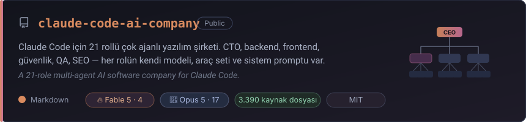

**Yazılım geliştirici · Yapay zekâ ve çok ajanlı sistemler**

*Software developer · AI & multi-agent systems*

---

### 👋 Merhaba / Hey

Yazılım geliştiriyorum ve son dönemde **yapay zekâ ajanlarının birlikte çalıştığı sistemler**
üzerine yoğunlaşıyorum — tek bir modele iş yaptırmak yerine, her biri kendi uzmanlığı, kendi
araç seti ve kendi modeli olan rollerden ekipler kurmak.

*I build software, currently focused on **multi-agent AI systems** — instead of prompting one
model, assembling teams of roles that each have their own expertise, tools and model.*

---

### 🏢 Öne çıkan proje / Featured project

**[→ Repoya git / View repository](https://github.com/qaptanjes/claude-code-ai-company)**

Claude Code'a tek bir görev veriyorsun, arkada 21 uzman rol devreye giriyor: CTO mimariyi
kuruyor, araştırmacı GitHub'ı tarıyor, kütüphaneci 2.500+ hazır skill arasından işe
yarayanları buluyor, geliştiriciler kodu yazıyor, güvenlik ve QA denetliyor.

Her rolün kendi modeli var — en zor muhakeme gerektiren 4 rol **Fable 5**, geri kalan 17'si
**Opus 5**. Atama fiyata göre değil, yetenek–süre dengesine göre yapıldı.

---

### 🛠️ Kullandıklarım / Stack

---

### 🧠 Üzerinde çalıştığım konular / What I work on

| | |
|---|---|
| 🤖 **Çok ajanlı sistemler** | Rol bazlı ajan mimarileri, faz yönetimi, paralel çalıştırma |
| 🔌 **MCP** | Model Context Protocol sunucuları ve entegrasyonları |
| 📐 **Ajan tasarımı** | Sistem promptu tasarımı, araç sınırlandırma, model seçimi |
| 💾 **Kalıcı hafıza** | Dosya tabanlı kurumsal hafıza, oturum ötesi bağlam |

---

💬 Çok ajanlı sistemler, Claude Code veya AI destekli geliştirme üzerine konuşmak istersen
[issue aç](https://github.com/qaptanjes/claude-code-ai-company/issues).

*Open an issue if you want to talk about multi-agent systems, Claude Code, or AI-assisted development.*

